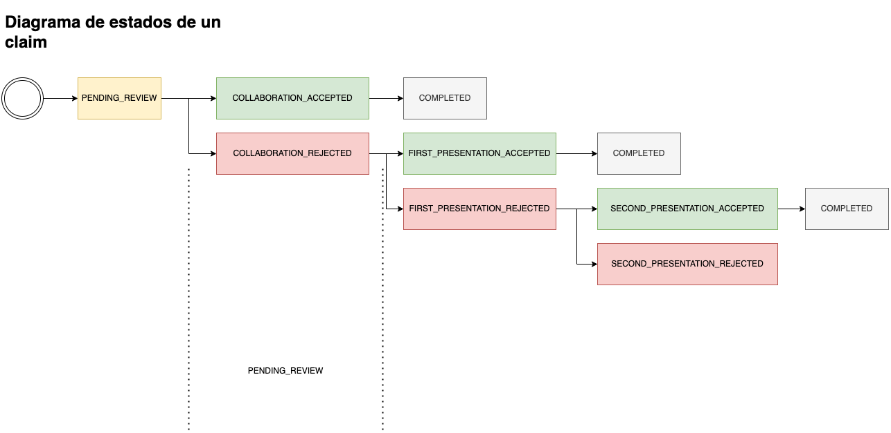

Este documento proporciona una descripción detallada de los diferentes estados que puede tener un claim (reclamación) en Kausanna. Comprender estos estados es esencial para el seguimiento y gestión adecuados de las reclamaciones.

## Diagrama de estados

## Descripción de los Estados

### PENDING_REVIEW

El claim ha sido creado y está esperando revisión inicial por parte del consumidor (en este caso, vos). Este es el primer estado después de la creación de un claim.

### COLLABORATION_ACCEPTED

El claim ha sido aceptado para colaboración. Esto indica que el merchant ha aceptado colaborar en la resolución del claim.
Se finaliza la disputa y se procede a la resolución del claim.

### COLLABORATION_REJECTED

La parte contraria ha rechazado colaborar en el claim. Esto puede llevar a una escalación del claim a un proceso de resolución formal.
Acá el merchant se encarga de subir la documentación necesaria para la resolución del claim.

### SECOND_PRESENTATION_ACCEPTED

La segunda presentación del claim ha sido aceptada, lo que indica progreso hacia la resolución del claim.
En este paso, el comprador aceptó perder la disputa y se procede a la resolución del claim.

### SECOND_PRESENTATION_EXPIRED

El plazo para la segunda presentación ha expirado sin que se presentara la documentación requerida o sin acción por parte del reclamante.
Se procede a la resolución del claim, la parte perdedora es la que no respondió a tiempo.

### SECOND_PRESENTATION_PENDING

La segunda presentación del claim ha sido realizada y está pendiente de revisión.

### SECOND_PRESENTATION_DONE

La revisión de la segunda presentación se ha completado. Esto no indica aceptación o rechazo, sino que la revisión necesaria ha concluido.

### DOCUMENTATION_REJECTED

La documentación presentada para el claim ha sido rechazada por insuficiente o inadecuada para respaldar el caso.

### SECOND_PRESENTATION_COMPLETED

Todas las fases de presentación y documentación para el claim han sido completadas satisfactoriamente.

### COMPLETED

El claim ha sido completamente resuelto. Este estado indica que todas las acciones necesarias se han tomado y el claim se ha cerrado.

<Info>
  Es importante monitorear el estado de sus claims en Kausanna para responder adecuadamente en cada
  etapa del proceso.
</Info>

<Tip>
  La comunicación efectiva y la presentación oportuna de documentación son clave para avanzar
  positivamente a través de los estados del claim.
</Tip>

<Warning>
  Mantenga un registro detallado de todas las comunicaciones y documentaciones enviadas como parte
  del proceso de claim, ya que esto puede ser crucial para la resolución de disputas.
</Warning>
